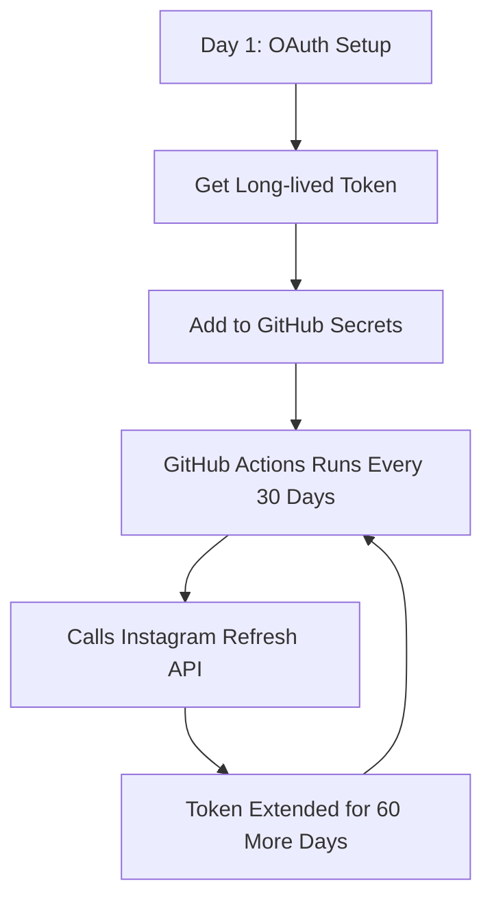

# Simple Instagram Token Setup (GitHub Actions Refresh)

## The Simple Solution

Based on the [Instagram API documentation](https://developers.facebook.com/docs/instagram-platform/instagram-api-with-instagram-login/business-login#refresh-a-long-lived-token), we can simply **refresh the existing token** every 30 days. No complex automation needed!

### Key Insight:
> "Your app user's long-lived access token can be refreshed for another 60 days as long as the existing conditions are true"

The **same token value is returned** when refreshed, so no environment variable updates are needed!

## Setup Steps

### 1. One-Time OAuth Setup

1. **Set up your environment variables:**
   ```env
   INSTAGRAM_APP_ID=your_app_id
   INSTAGRAM_APP_SECRET=your_app_secret
   INSTAGRAM_REDIRECT_URI=https://yourdomain.com/instagram-callback
   ```

2. **Complete OAuth flow:**
   - Visit `/admin/instagram-setup` on your site
   - Click "Authorize Instagram Account" 
   - Get your long-lived token from the console output

3. **Add the token to environments:**
   - **Local**: Add to your `.env` file
   - **Vercel**: Add to environment variables in dashboard
   - **GitHub**: Add `INSTAGRAM_LONG_LIVED_TOKEN` as a repository secret

### 2. GitHub Actions Auto-Refresh

The included GitHub Actions workflow (`.github/workflows/refresh-instagram-token.yml`) will:

- ✅ **Run every 30 days** automatically
- ✅ **Refresh your token** for another 60 days  
- ✅ **No environment variable updates** needed (same token value)
- ✅ **Notify on failure** if manual action is required

### 3. GitHub Secrets Setup

1. Go to your GitHub repository
2. Go to Settings → Secrets and variables → Actions
3. Add repository secret:
   - **Name**: `INSTAGRAM_LONG_LIVED_TOKEN`
   - **Value**: Your long-lived token from step 1

That's it! 🎉

## How It Works



### Timeline:
- **Day 1**: OAuth setup, token valid for 60 days
- **Day 30**: GitHub Actions refreshes token (30 days left)
- **Day 60**: GitHub Actions refreshes token again  
- **Day 90**: GitHub Actions refreshes token again
- **Forever**: Automated refreshing every 30 days

## Manual Testing

You can test the refresh manually:

```bash
# Test the refresh API call
curl -i -X GET "https://graph.instagram.com/refresh_access_token?grant_type=ig_refresh_token&access_token=YOUR_TOKEN"
```

Or trigger the GitHub Action manually:
1. Go to your repository → Actions tab
2. Select "Refresh Instagram Token" workflow  
3. Click "Run workflow" button

## Troubleshooting

### Workflow Fails
- Check that `INSTAGRAM_LONG_LIVED_TOKEN` secret is set correctly
- Verify your token hasn't expired (max 60 days without refresh)
- Re-run the OAuth flow if needed

### Token Requirements
The token can only be refreshed if:
- ✅ Token is at least 24 hours old
- ✅ Token is still valid (not expired)  
- ✅ User granted `instagram_business_basic` permission

## Benefits

| Before | After |
|--------|--------|
| Manual token updates every 60 days | Automatic refresh every 30 days |
| Risk of forgetting = broken feed | Automated, no human intervention |
| Complex Vercel API integration | Simple GitHub Actions workflow |
| Multiple environment variables | One token, no updates needed |

## Files Created

- ✅ `.github/workflows/refresh-instagram-token.yml` - Auto-refresh workflow
- ✅ `src/lib/instagram-auth.ts` - Simplified auth service  
- ✅ Updated environment variable examples

**Result**: Set it once, forget it forever! 🚀
